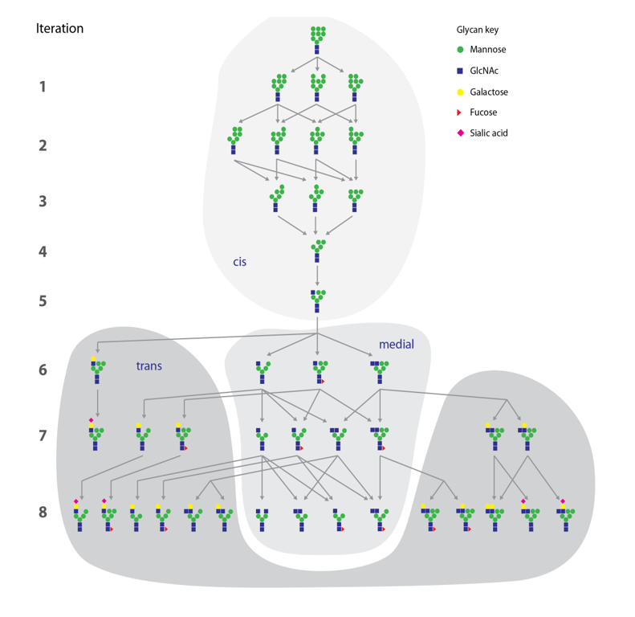

# Project Name
This program is for generating N-glycosylation reactions. You can use it as an input to cytoscape, or to generate an excel table to 
extract useful information for predicting the outcome of kinetic reactions. This is just a starting generator, since this pathway itself is deficient. 
Reason behind it is, that I don't know how much of this is intelectual property. For example Gene is the same as Enzyme name, because a lot of pharmaceutical
companies use their own abbreviations for genes and enzmyes. Naming for the Gylcan structures is taken from Oxford nomenclature. And conditions for appending glycosylation blocks 
on the unglycosylated product are from my own reasearch: doi.org/10.1002/bit.27660 and from Sphan 2015: 10.1016/j.ymben.2015.10.007

## Table of contents
* [General info](#general-info)
* [Screenshots](#screenshots)
* [Setup](#setup)
* [Features](#features)
* [Status](#status)
* [Contact](#contact)

## General info
Starting input of Unglycosylated product will be F0M0A0G0S0. Where each letter presents a glycosylation(building) block and number that follows presents the amount of
the blocks on the glycan - F=Fucose, M=Manose, A=GlucNAc, G = Galactose, S = Sialic Acid. For example F0M3A2G1S1 glycan is afucosylated(has no fucose), 3 mannose
2 GlucNACs and 1 Galactose and 1 Sialic Acid.  
List of enzymes present: 
* ManI
* GalT
* GnT
* SiaT

For more accurate N-Glycoslyation pathway we would have acknowledge more enzmyes. Like GnTIII, or GnTIV/GnTV, which can be incorporated, 
but in my opinion it is not necessary for a basic understanding of this pathway.     
     

Motivation behind this was that I professionaly worked on N-glycosylation and everywhere I worked the reaction pathway was the "confusing" part.

I lot of different rules apply for different strains. This one was general. 

## Screenshots

## Setup
Program was written is Spyder and with Pandas package

## Features
Program makes a reaction pahtway for N-glycosylation and includes different enzymes mechanism. 
List of enzymes present: 
* ManI
* GalT
* GnT
* SiaT

To-do list:
* We could improve with different enzymes
* Put different isomers; for example from GnTIV and GnTV...

## Status
Project is: _in progress_

## Contact
Created by [@VEZ](https://www.linkedin.com/in/vivian-erklavec-zajec/) - feel free to contact me!